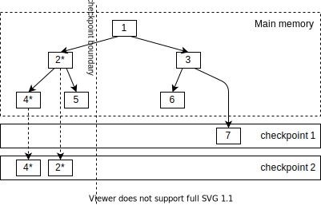
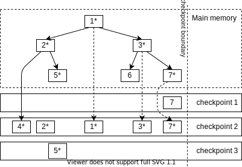
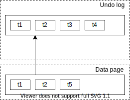

OrioleDB Architecture
=====================

Indexes
-------

OrioleDB stored data in index-organized tables.  Consider the example of the `vegetables` table, which has a primary index on `id` and a secondary index on `count`.

| Id | Name     | Count |
| -- | -------- | ----- |
|  1 | Tomato   |    10 |
|  2 | Cucumber |     3 |
|  3 | Cabbage  |     7 |
|  4 | Melon    |     6 |

The data structure behind the `vegetables` table is given below.  Both primary and secondary indexes comprise variations of B+-tree.  Leaf tuples are marked blue, non-leaf tuples are marked green, high-keys are marked yellow.  The primary index's non-leaf tuples and high keys consist of the primary key columns; leaf tuples are table rows themselves.  Non-leaf and leaf tuples, high keys of the secondary index consists of secondary index columns and primary index columns.

The primary index and secondary index are not tied together; they are only connected by logical values persisting in table rows.  OrioleDB automatically creates a primary index on the virtual `ctid` column when no primary index is given.

Dual pointers
-------------

OrioleDB uses a so-called `dual pointers` scheme to evade buffer mapping and corresponding bottlenecks.  The idea of `dual pointers` is that downlinks in non-leaf in-memory pages could point to either in-memory or storage pages.  Therefore, one could navigate in-memory pages using direct links without any buffer table.  The storage page must be loaded into the main memory if one needs to traverse downlink, which points to storage.  The corresponding downlink had to be replaced with an in-memory downlink.

The diagram below shows the simplified structure of the OrioleDB B-tree.  This diagram does not detail the page contents: main memory pages are numbered the same as their storage prototypes.  Arrows depict downlinks.

The main memory page could refer to both main memory and storage pages.  However, storage pages can refer to storage pages only.  Therefore, besides main memory and storage pages `1`, `2` and `3` are marked the same as storage pages `1`, `2` and `3`, their contents are different in the above matter.

In order to implement this scheme, we have to sacrifice rightlinks.  That would be too complex (and slow?) to toggle downlinks and rightlinks between in-memory and storage pointers.

Technically, OrioleDB B-trees still contain rightlinks, but they have only temporary usage during page splits.  Rightlink exists only between splitting a new page and insertion downlink to the parent.  Therefore, if the completed split happens concurrently with locating a tree page, one must retry from the parent (see find_page() function).  Stepping tree pages right and left become more complex too.  Instead of using rightlinks (and leftlinks) one have to find siblings from parent (see find_right_page() and find_left_page()).  However, this complexity is more than justified by better vertical scalability.

See [concurrency algorithms in OrioleDB B-tree](concurrency.md) for details.

Page structure
--------------

OrioleDB implements a novel page structure optimized for modern multi-core machines.

There is a `state` atomic variable in a page header.  This atomic variable provides the following functionality:

1.  Exclusive lock on a page.  There could be only one exclusive page locker at a time.  The exclusive lock itself does not give the right to modify page contents or prevent other processes from reading the page.
2.  Exclusive locker may upgrade his lock to block page readers.  Once readers are blocked, the locker may start modification of page contents.
3.  Tracking change count for page contents.  Thanks to that, one may copy part of the page (or do some computations) and check that page was not changed concurrently (and retry if it was).

See `src/btree/page_state.c` for details.

The tuples on the page are split into chunks.  There is also an area of high keys, where each chunk has an associated high key.  The high key of the last chunk is simultaneously the high key of the page.  Thank this, if one needs a particular tuple on the page, he does not need to copy the whole page.  It is enough to copy the high keys area, find the appropriate page chunk, and copy it.  `PartialPageState` structure is responsible for tracking partially read pages.

In the future, we plan to get rid co copying in the majority of page access patterns and implement vectorization for faster search within the page.

Copy-on-write checkpoints
-------------------------

OrioleDB utilized copy-on-write checkpoints and row-level WAL.  The example below illustrates the big picture of copy-on-write checkpoints.

For example, page number `7` was modified.  It was marked as `7*`.

Checkpoint has written `7*` to the storage.  It has written to the free space according to the copy-on-write principle.  When checkpoint considers writing a non-leaf page, it replaces in-memory downlinks with storage ones.  Therefore, page `3` is also considered modified because we need to reference the new `7*` from the storage page.  So, page 3*` is also written to the free storage space. Similar to 1*`.

Once the checkpoint is completed, old storage page images `1`, `3`, and `7` are marked as free space.

Therefore, a consistent tree image exists in storage every moment.

OrioleDB supports fuzzy checkpointing.  That is, we allow tree modification concurrent to checkpointing.  That is essential because too fast or frequent checkpoints could cause a write flood.

Consider the following example.  The tree contains pages 1 – 7.  `Pages 1 – 6` are present in both main memory and storage (checkpoint 1), while pages 7 are present in storage only.  Page `4` was modified (`4*`).

Checkpointing was started to traverse the tree from left to right, and it passed the subtree of pages `2`, `4` and `5`.  Page images `4*` and `2*` were written to checkpoint 2.

Concurrently, page 5 was modified (`5*`).  Background writer wrote page image `5*`.  Page `5` belongs to the tree part, which is already processed by checkpointer.  That is why we cannot write it to checkpoint 2, because it can affect its consistency.

Page number `7` was also concurrently modified but was not written by a background writer.

Then, checkpointer finished writing page images `7*`, `3*` and `1*` to checkpoint 2.

In general, checkpointing of non-leaf pages is more tricky than described above.  While the checkpointer is writing children of non-leaf page, concurrent splits and merges could happen.  In such cases, we have to reconstruct non-leaf pages based on the state of its children as we met them.  Therefore, we might write to the storage a non-leaf page image, which never existed in the main memory.  Furthermore, we could even write multiple storage pages corresponding to a single main memory page (imagine merges happen above the checkpoint boundary, while splits happen below the checkpoint boundary).  Finally, that is OK, because it reflects how checkpointer wrote the children.

At the moment of time, there could be multiple checkpoints which use different but overlapping sets of blocks.  Therefore, [free space management](fsm.md) becomes an untrivial task.

See [the detailed description of checkpointing algorithm](checkpoint.md).

Undo log
--------

OrioleDB implements transactions and MVCC using UNDO log.  The row-level undo records comprises chains of row versions.  Particularly, tuple headers are connected in lists, where the head is located on the data page, and the rest of the elements are located in undo log.  See the diagram below.

Some undo records include both tuple header and tuple body (update record), while some do not alter tuple body and contain just tuple header (delete and row-level lock records).

Besides a presence in row versions chains, undo records are also present in transaction chains.  If the transaction aborts, the corresponding chain is traversed to replay all the undo records.

The snapshot of undo log is written out during checkpointing.  We need this because, during recovery, we might need to rollback some of the transactions that were in progress during checkpointing.  Besides checkpointing, we do not have to write the undo log to the storage except when it does not fit to corresponding shared memory.

Sometimes we need to replay only part of the transaction chain.  For instance, OrioleDB's implementation of `ROLLBACK TO SAVEPOINT` replays the transaction's undo log chain to the given point.  Aborting speculative insertions during `INSERT ... ON CONFLICT ...` works the same way.  However, once we replay some part of the transaction undo the chain, we might still need it during recovery because corresponding data could be (partially) checkpointed before replay.  In order to track this, we add special `branch` undo records, which gives recovery a possibility to walk already replayed branches.

Some undo records also require some action on commit.  For instance, our implementation of `TRUNCATE` issues an undo record, which deletes old relfilenodes on transaction commit and deletes new relfilenodes on a transaction abort.  We track the separate list for undo records requiring on-commit actions.

OrioleDB also supports block-level undo records.  The block-level undo records are the changes applied to the whole page.

The diagram below gives an example of a `compact` block-level undo record.  Here the data pages contains tuples `t1`, `t2` and `t5`.  However, a page image in the undo log contains tuples `t1`, `t2`, `t3`, and `t4`.  That means, when tuples `t3` and `t4` were deleted, we lacked space for a new tuple `t5`.  In order to do this, we made a `compaction` first.  Therefore, we issue a page-level undo record and erase tuples `t3` and `t4` to fit `t5`.

OrioleDB has three types of block-level undo records:

1.  Compact undo record: one data page references one undo page image,
2.  Split undo record: two data pages reference one undo page image,
3.  Merge undo record: one data page references two undo page images.

OrioleDB uses both circular buffers and block buffers for accessing the undo log.  See [undo log storage](buffering.md) for details.

Row-level WAL
-------------

OrioleDB implements a row-level write-ahead log (WAL) used for both recovery and replication.  Row-level WAL requires structurally consistent checkpoints described above.  Row-level WAL records include transaction start, row insert, row update, row delete, transaction commit/abort etc.  The complete list of OrioleDB's WAL records is given in `include/recovery/wal.h` header.

OrioleDB table has the following B-trees for its data:

1.  TOAST tree,
2.  Primary key tree,
3.  Secondary keys trees.

TOAST and primary key trees are subjects of WAL-logging, while secondary keys trees aren't.  Secondary keys are recovering based on changes in TOAST and primary key.

Since OrioleDB implements fuzzy checkpointing, we require idempotency property here.  Checkpointer visits TOAST and primary key before secondary keys.  Therefore, secondary keys might have a newer state than TOAST and primary keys in the checkpoint.  Idempotency guarantees that if some changes are applied to secondary keys twice or more, it does not affect the final state.

OrioleDB implements parallel application of WAL records.  It launches `orioledb.recovery_pool_size` number of workers.  Each worker is responsible for its own set of primary key values (according to hash value).  The startup process distributes row-level WAL records to the queues connected to workers.

Queues might be processed at different paces.  In order to evade MVCC anomalies, we assume the transaction to be committed and visible for readers only once all the workers have completed all the pieces of work associated with that transaction.

See [the details about OrioleDB's recovery](recovery.md).

System catalog
--------------

In OrioleDB, checkpointing, page writing/eviction, and recovery manipulate trees logically.  In order to do so, they need to be able to compare tuple keys, calculate tuple lengths, etc.  One who performs the routines above needs access to some meta-information.  However, we need to do these routines without a fully initialized connection to PostgreSQL database.

In order to resolve this problem, OrioleDB implements "system trees" -- OrioleDB's analog of system catalog with minimal information required to perform the routines.  System trees contain information about tables, associated trees, data types etc.  See `src/catalog/sys_trees.c` for details.

Data compression
----------------

OrioleDB supports data compression at the block level.  In compressed trees, storage pages are compressed with the `zstd` algorithm.  That is, storage pages have variable lengths.  Because of this, we have to maintain more complex mechanisms for managing free space in compressed trees.

OrioleDB implements this free space management using two system trees: `SYS_TREES_EXTENTS_OFF_LEN`, `SYS_TREES_EXTENTS_LEN_OFF`.  Both these trees contain information about free space extents.  The first maintains extents sorted by offset, while the second one sorts extents by length then offset.  The second tree allows searching for the most appropriate free extent for the new storage block.  The first tree is used to find adjacent extents and initiate their join.
